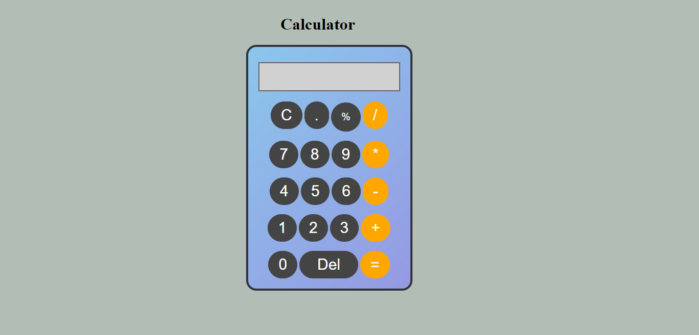

## Javascript Calculator

### Hello, I am Dipanshu Shukla

I have build calculator with the help of `HTML`, `CSS` and `JavaScript`.

``` Learning Key points Javascript```
- Generate an array of the all the buttons and then apply the addEventListener to all the buttons.
- `eval() :` It evaluates a specified string as Javascript code and executes it.
- `slice():` The slice( ) method returns selected elements in an array, as a new array. The slice( ) method selects from a given start, up to a (not inclusive) given end.

This is the live link of the project.

Checkout Here [Live Link](https://dp-calculator.netlify.app)



